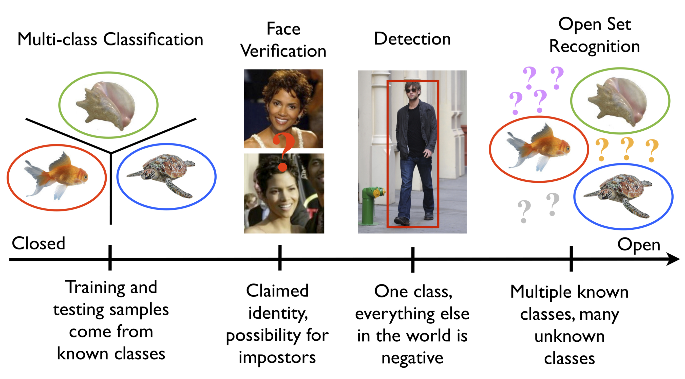
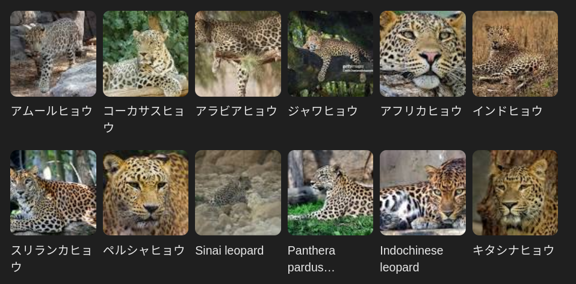
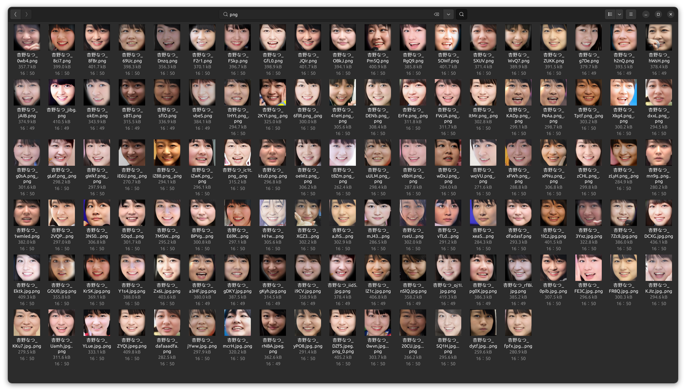
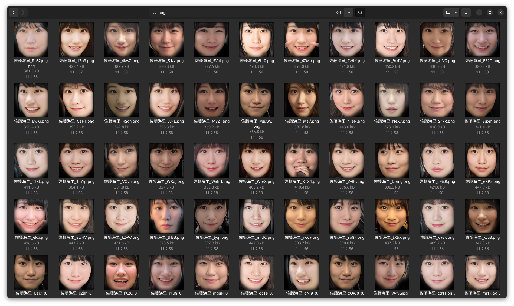
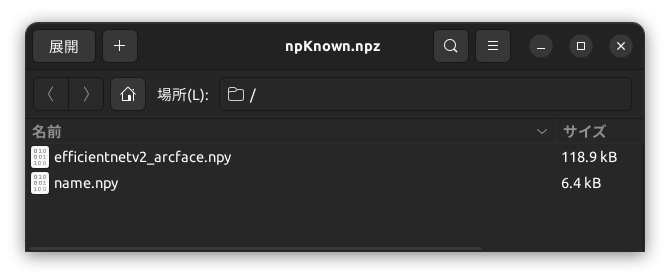
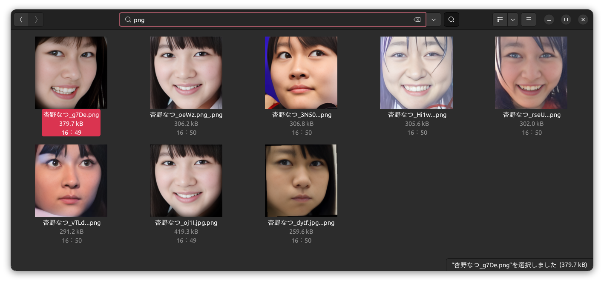
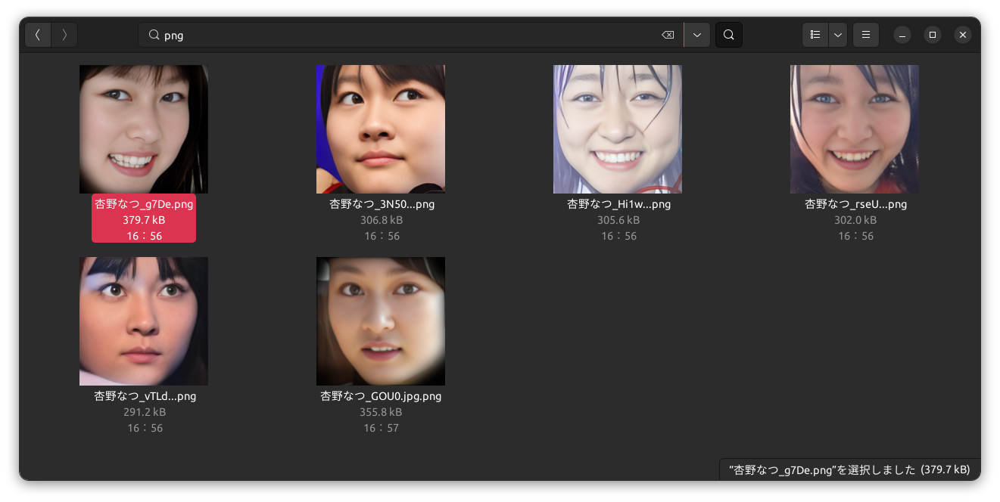

# コサイン類似度データの中の外れ値をもつファイルを見つける方法


- [コサイン類似度データの中の外れ値をもつファイルを見つける方法](#コサイン類似度データの中の外れ値をもつファイルを見つける方法)
  - [はじめに](#はじめに)
  - [使用する顔画像データセット](#使用する顔画像データセット)
  - [補足：コサイン類似度と計算](#補足コサイン類似度と計算)
    - [その1: ベクトルの内積の計算](#その1-ベクトルの内積の計算)
    - [その2: 各ベクトルのノルムを計算](#その2-各ベクトルのノルムを計算)
    - [その3: コサイン類似度を求める](#その3-コサイン類似度を求める)
  - [コサイン類似度データから外れ値を見つける方法](#コサイン類似度データから外れ値を見つける方法)
    - [平均と標準偏差による閾値設定](#平均と標準偏差による閾値設定)
    - [k-Nearest Neighbors (k-NN) の距離による外れ値検出](#k-nearest-neighbors-k-nn-の距離による外れ値検出)
    - [局所外れ値因子 (Local Outlier Factor, LOF)](#局所外れ値因子-local-outlier-factor-lof)
    - [`FAISS`を使った外れ値検出](#faissを使った外れ値検出)
  - [実装例とサンプルコード](#実装例とサンプルコード)
    - [`npKnown.npz`の作成](#npknownnpzの作成)
    - [平均と標準偏差による閾値設定の例](#平均と標準偏差による閾値設定の例)
    - [t-SNEを使った視覚化の例](#t-sneを使った視覚化の例)
  - [参考リンク・文献](#参考リンク文献)


## はじめに
皆さん、画像分類、やってますか？

世の中は大規模言語モデルや動画生成AIが話題の中心になっていますが、画像分類、特にオープンセット分類[^0]の需要はますます高まっています。
[^0]: 学習データに含まれないクラスのデータも識別し、その場合には「未知のクラス」として分類するような画像分類のタスク。例えば工業製品の不良品チェックや農作物の分類、顔認証など。

<figure>
  
  <figcaption>引用：Open Vision (NSF IIS-1320956)</figcaption>
</figure><br />

そのようなオープンセット分類に、例えば顔認証があります。日本人の顔認識に使う学習モデルのひとつに、拙作の`JAPANESE FACE v1`があります。日本人専用にチューニングしてありますので、[日本人の顔に対する感度が優れています](https://github.com/yKesamaru/FACE01_trained_models/tree/master)。この学習モデルはいわゆるコミュニティーライセンスですので[^1]、顔認識に使ってください。
[^1]: 詳しくは[ライセンス](https://github.com/yKesamaru/FACE01_trained_models/blob/master/LICENSE)をご参照ください。

さて、顔学習モデルを作成するにあたり、集められた**データセットのクレンジング**には相当気を使います。

下の図はヒョウの分類です。ヒョウを分類する学習モデルを作成しようとした場合、その**データセットのクレンジング**には、特に気を使わなければなりません。

例えばアムールヒョウのフォルダにアラビアヒョウの画像ファイルが入っていてはいけないのです。



この場合（アムールヒョウのフォルダにアラビアヒョウの画像ファイルが入っている場合）で言うと、アラビアヒョウの画像ファイルが「外れ値」をもつファイルということになります。

顔認証のための学習データであれば、例えば1つのディレクトリに複数の同一人物の異なる顔画像ファイルがあったとき、もしかしたら別人の顔画像がふくまれているかも知れません。（同姓同名の違う人物の顔画像ファイルが紛れている場合）

あるいは、別人とは言わないまでも、顔データセットとしてふさわしくない画像かも知れません。（顔加工ソフトによって修正された顔画像ファイルなど）

**外れ値を持つ画像ファイルを探し出して除去することは、学習データを堅牢な物にするためにとても重要**です。

1つのディレクトリならば目視すればよいですが、何百何千とディレクトリ（＝クラス）が存在るのであれば、自動化するべきです。

この記事では、コサイン類似度を使って複数の顔画像から生成したベクトルの中で「外れ値」を見つけるためのさまざまな方法について吟味します。

各手法の概要、メリット・デメリット、そしてグラフ化して視覚化する場合の手法を共有します。

実際のコードでは、顔認証フレームワークである`FACE01`[^2]を用います。こちらもいわゆるコミュニティーライセンスとなっています。
[^2]: [FACE01](https://github.com/yKesamaru/FACE01_DEV)

**本来同一のクラスにしなくてはいけないのに異なるクラスになっている場合のチェック**は、「[【faiss】なにこれすごい。顔データセットの間違い探し　成功編③](https://zenn.dev/ykesamaru/articles/4e40e0285b0b66)」を参照してください。

https://zenn.dev/ykesamaru/articles/4e40e0285b0b66

## 使用する顔画像データセット

<!--  -->


> [!NOTE]
> 
> なおこの記事で取り扱う画像ファイルは記事を作成するための例であって、このサンプルを使って顔学習モデルを作製しているわけではないことをおことわりします。


## 補足：コサイン類似度と計算
釈迦に説法になりますが、おさらいとしてコサイン類似度の定義と類似度の計算方法を補足として記述します。この部分が不要な方は次の章へスキップしてください。

コサイン類似度は2つのベクトル間の角度のコサイン値を計算することで類似度を評価する場合に用いられます。

値は-1から1までの範囲を取りますが、顔認識などの特徴ベクトルにおいては、通常0から1の範囲で1に近いほど似ていると評価されます。

2つのベクトル \( \mathbf{a} \) と \( \mathbf{b} \) のコサイン類似度は次の式で定義されます。

\[
\cos(\theta) = \frac{\mathbf{a} \cdot \mathbf{b}}{||\mathbf{a}|| \times ||\mathbf{b}||}
\]

- \( \mathbf{a} \cdot \mathbf{b} \) は、ベクトル \( \mathbf{a} \) と \( \mathbf{b} \) の**内積**です。
- \( ||\mathbf{a}|| \) と \( ||\mathbf{b}|| \) は、それぞれのベクトルの**ノルム**（長さ）です。


### その1: ベクトルの内積の計算
2つのベクトル \( \mathbf{a} \) と \( \mathbf{b} \) の内積は、2つのベクトルの対応する要素を掛け合わせたものを全て足し合わせて求めます。

\[
\mathbf{a} \cdot \mathbf{b} = a_1 \times b_1 + a_2 \times b_2 + \dots + a_n \times b_n
\]

2つのベクトルが同じ方向を向いているときに大きな値が得られ、関係ない方向に向いているときには小さな値や負の値になります。

### その2: 各ベクトルのノルムを計算
次にベクトル \( \mathbf{a} \) と \( \mathbf{b} \) のノルム（大きさ）を計算します。各ノルムは、各要素を2乗して合計した数の平方根をとることで得られます。

\[
||\mathbf{a}|| = \sqrt{a_1^2 + a_2^2 + \dots + a_n^2}
\]
\[
||\mathbf{b}|| = \sqrt{b_1^2 + b_2^2 + \dots + b_n^2}
\]

### その3: コサイン類似度を求める
最後に、内積の値を2つのノルムの積で割ることで、コサイン類似度を求めます。

\[
\cos(\theta) = \frac{\mathbf{a} \cdot \mathbf{b}}{||\mathbf{a}|| \times ||\mathbf{b}||}
\]

この計算によって得られる値が、2つのベクトル間のコサイン類似度です。

## コサイン類似度データから外れ値を見つける方法

### 平均と標準偏差による閾値設定

**概要**

コサイン類似度の平均と標準偏差を用いて、平均から一定の標準偏差を超える点を外れ値として判定します。

**閾値の設定**

この手法ではコサイン類似度の平均と標準偏差を使って、異常なデータ点を「平均から一定の標準偏差の距離を超える点」とします。

\[
\text{閾値} = \text{平均} \pm k \times \text{標準偏差}
\]

\( k \)は調整パラメータで、一般的には1.5や2、あるいは3がよく使用されるようです。例えば\( k = 2 \)と設定すれば、コサイン類似度が平均から2標準偏差以上離れたデータ点を外れ値とみなします。

**メリット**
- 単純で実装が容易。
- データの分布を直感的に利用できる。

**デメリット**
- データの分布に依存しすぎるため、正規分布に近い形状のデータセットで有効ですが、極端に歪んだ分布（例えば偏りが大きい場合）では外れ値が検出できない場合があるようです。

### k-Nearest Neighbors (k-NN) の距離による外れ値検出

**概要**

k近傍法を用いて、各データ点の近隣とのコサイン距離を評価し、その距離が一定の閾値を超えるものを外れ値とします。

**コサイン距離**は、コサイン類似度を距離の概念に変換したものです。一般的には以下のように定義されます。

\[
\text{コサイン距離} = 1 - \cos(\theta)
\]

コサイン距離は0から2の範囲を取り、値が小さいほどベクトル間の類似性が高い（距離が近い）ことを示します。

k-NN法やクラスタリングなどのアルゴリズムでは、データ間の「距離」を測る必要があります。コサイン類似度は類似性の指標であるため、そのままでは距離計量として適用しにくいです。そこで、類似性を距離に変換するためにコサイン距離を使用します。

ユークリッド距離では適切な距離を測れない場合でも、コサイン距離はベクトルの方向性を重視するため、より適切な類似度評価が可能です。

この手法では、各データ点の近傍とのコサイン距離を計算し、距離が大きい（すなわち、類似性が低い）データ点を外れ値として検出します。

**メリット**
- 局所的な距離関係を考慮できるため、データのパターンを捉えやすい。
- 高い精度が期待できる。

**デメリット**
- 計算コストが高く、大規模データには不向き。
- kの選び方によって結果が左右されやすい。

### 局所外れ値因子 (Local Outlier Factor, LOF)

**概要**

LOFとは各データ点の周囲の密度を基準にして、他の点と比べてどれだけ「外れ」ているかを評価する手法です。

**外れ値をデータ全体のグローバルな視点ではなく、各点の「局所的な密度」に基づいて評価する**ため、、データ全体の平均や標準偏差を使用する方法よりも、密度が異なるクラスターを含むデータセットに対して有用と言えそうです。

通常のLOFではユークリッド距離を使用して近傍点を決定しますが、ここではコサイン距離を用います。先述しましたがコサイン距離は、コサイン類似度を基に次のように計算されます。

\[
\text{コサイン距離} = 1 - \cos(\theta)
\]

このコサイン距離は2つのベクトルの角度の違いを反映した距離であり、2つのベクトルが近い（類似性が高い）場合は0に近く、異なる方向にあるほど1に近づきます。

**LOFの計算手順**

1. **各点の\( k \)近傍点をコサイン距離で決定**
   - 各データ点に対して指定した\( k \)個の近傍点までの距離（k近傍距離）を算出。このk近傍には、512次元ベクトルに対する各点のコサイン距離が最も小さい順にk個のデータ点を選びます。
     - 具体的にはユーザー設定パラメータ\( k \)は、通常は小さな値（例：5〜20）に設定します。

2. **到達可能距離（Reachability Distance）の計算**
   - データ点Aとその近傍点Bに対して「到達可能距離」を算出。
     - 具体的には、到達可能距離は「BからAへの距離」と「Bのk近傍距離」のうち大きい方を採用します。

   \[
   \text{到達可能距離} = \max(\text{k近傍点のコサイン距離}, \text{他の点とのコサイン距離})
   \]

3. **局所密度の計算**
   - 各データ点に対してその周囲の点の到達可能距離の逆数を取ることで局所密度を算出。
     - 局所密度が高い点は「密集したエリアにある点」、低い点は「孤立したエリアにある点」を意味します。

   \[
   \text{局所密度} = \frac{k}{\sum_{i=1}^{k} \text{到達可能距離}(i)}
   \]

4. **LOFスコアの計算**
   - 各データ点の局所密度を周囲の点の局所密度と比較して、LOFスコアを算出します。
     - LOFスコアが1に近いほど、その点は周囲と似た密度であるため通常のデータと見なされます。
     - スコアが1より大きい場合、その点は周囲に比べて密度が低く、「外れ値」として扱われやすくなります。スコアが2や3に近づくほど、より強い外れ値と判断されます。

   \[
   \text{LOFスコア} = \frac{\text{他の近傍点の局所密度の平均}}{\text{自身の局所密度}}
   \]

**メリット**
- 局所的な密度を基準とするため、異なる密度を持つクラスタが存在しても外れ値をうまく検出できる。

**デメリット**
- パラメータ調整が難しく、適切な近隣数を選ぶ必要がある。
- 大規模データセットでの計算負荷が大きい。
- \( k \)の設定が結果に影響を与えるため、適切なパラメータ調整が重要（\( k \)を小さくしすぎるとノイズの影響を受けやすくなり、大きくしすぎると局所性が失われる。）

### `FAISS`を使った外れ値検出
**FAISSライブラリ**を使用して高次元ベクトル（512次元）の顔特徴ベクトルから、類似していないデータを効率的に検索する手法を紹介します。

手法としては、以前紹介した「データセットから似ている顔を検索する」方法とは逆に、**類似性の低いデータ（外れ値）を検出する**アプローチです。

手順としては以下の5ステップになります。

1. ベクトルの読み込みと前処理
   - まず、顔画像から特徴ベクトルを抽出し、L2正規化を行います。L2正規化は、データのスケールを統一し、距離計算や類似性の計算を安定させるための手順です。また、正規化することで、内積ベースの類似度計算が可能になります。
   - 各顔特徴ベクトルは、512次元のベクトルとして読み込まれますが、形状が `(N, 1, 512)` のように余分な次元がある場合も考慮し、データの形状を `(N, 512)` に変換します。

2. FAISSインデックスの作成とデータ追加
   - FAISSの`IndexFlatIP`（内積ベースのインデックス）を使用し、特徴ベクトルの検索インデックスを作成します。IndexFlatIPはデータセットが小規模な場合や、高速に内積ベースの検索を行いたい場合に適しており、直接データ追加後にすぐ使用できます。
   - インデックスを作成し、全てのデータベクトルを追加することで、クエリ時に各ベクトル間の類似度（内積ベース）を計算できる状態になります。

3. クエリベクトルとデータセット間の類似性計算
   - 外れ値検出では、各データに対して他のデータとの類似度を計算し、特に類似度の低いデータを抽出することが目的です。
   - コード内では、全データに対して類似度を計算し、類似度の高い上位k個のベクトル情報（近傍）を取得しています。その結果から、対象データ以外の近傍ベクトルとの類似度の平均を算出します。

4. コサイン類似度の計算と外れ値判定
   - FAISSで取得される類似度スコア（`D`の値）は内積に基づいているため、ベクトルが正規化された場合は**コサイン類似度**として解釈できます。この類似度を基に、閾値よりも類似度が低いデータを「外れ値」と判定します。
   - コードでは、対象データ以外の近傍ベクトルとの類似度の平均が、設定した閾値（例えば0.3）を下回る場合に、該当データを「外れ値」として記録しています。

5. 外れ値検出の具体的な判断基準と移動処理
   - **閾値設定**: 外れ値検出の閾値としてコサイン類似度が0.3未満のデータを外れ値としています。閾値はデータセットの特性に応じて調整可能です。
   - **外れ値の保存処理**: 外れ値として判定されたファイルは、指定のディレクトリ（`外れ値ファイル`）に自動で移動されます。これにより、通常のデータと外れ値を分離して管理することが可能です。


## 実装例とサンプルコード

ここでは、本文中で紹介した外れ値検出の手法のサンプルコードを提供します。以下に、Pythonでの実装例を示します。

### `npKnown.npz`の作成
`example/make_npKnown_file.py`を実行します。ドキュメントは[こちら](https://ykesamaru.github.io/FACE01_DEV/example.html#module-example.make_npKnown_file)です。

https://github.com/yKesamaru/FACE01_DEV/blob/1cab4e4ceeeea45888d4f54f6c8da1be34e46b52/example/make_npKnown_file.py#L1-L79


<figure>
  
  <figcaption>作成された`npKnown.npz`</figcaption>
</figure><br />



作成された`npKnown.npz`の中身は図のようになっています。`efficientnetv2_arcface.npy`に512次元ベクトルが、`name.npy`にファイル名が、それぞれバイナリの形で格納されています。


LOF

```bash
(venv) terms@terms:~/ドキュメント/Outlier-Detection-in-Cosine-Similarity-Data$  cd /home/terms/ドキュメント/Outlier-Detection-in-Cosine-Similarity-Data ; /usr/bin/env /home/terms/ドキュメント/Outlier-Detection-in-Cosine-Similarity-Data/venv/bin/python /home/terms/.vscode/extensions/ms-python.debugpy-2024.13.2024103001-linux-x64/bundled/libs/debugpy/adapter/../../debugpy/launcher 54385 -- LOF_Outlier_Detection.py /home/terms/ドキュメント/Outlier-Detection-in-Cosine-Similarity-Data/assets/杏野なつ/ 
元のmodel_dataの形状: (110, 1, 512)
修正後のmodel_dataの形状: (110, 512)
正規化前のデータの最大値: 7.992140293121338, 最小値: -8.26479434967041
正規化後のデータの最大値: 0.18281598389148712, 最小値: -0.1682458519935608
元のmodel_dataの形状: (110, 1, 512)
修正後のmodel_dataの形状: (110, 512)
正規化前のデータの最大値: 7.992140293121338, 最小値: -8.26479434967041
正規化後のデータの最大値: 0.18281598389148712, 最小値: -0.1682458519935608
データ数: 220
LOFによる外れ値検出を行います。
LOFスコアの最大値: 1.7416493892669678, 最小値: 0.9630197286605835
外れ値検出: 名前: 杏野なつ_vTLd...png, ディレクトリ: /home/terms/ドキュメント/Outlier-Detection-in-Cosine-Similarity-Data/assets/杏野なつ/, LOFスコア: 1.7416
外れ値検出: 名前: 杏野なつ_Hi1w...png, ディレクトリ: /home/terms/ドキュメント/Outlier-Detection-in-Cosine-Similarity-Data/assets/杏野なつ/, LOFスコア: 1.6756
外れ値検出: 名前: 杏野なつ_rseU...png, ディレクトリ: /home/terms/ドキュメント/Outlier-Detection-in-Cosine-Similarity-Data/assets/杏野なつ/, LOFスコア: 1.5488
外れ値検出: 名前: 杏野なつ_3N50...png, ディレクトリ: /home/terms/ドキュメント/Outlier-Detection-in-Cosine-Similarity-Data/assets/杏野なつ/, LOFスコア: 1.5478
外れ値検出: 名前: 杏野なつ_oeWz.png_.png, ディレクトリ: /home/terms/ドキュメント/Outlier-Detection-in-Cosine-Similarity-Data/assets/杏野なつ/, LOFスコア: 1.6272
外れ値検出: 名前: 杏野なつ_dytf.jpg...png, ディレクトリ: /home/terms/ドキュメント/Outlier-Detection-in-Cosine-Similarity-Data/assets/杏野なつ/, LOFスコア: 1.6574
外れ値検出: 名前: 杏野なつ_g7De.png, ディレクトリ: /home/terms/ドキュメント/Outlier-Detection-in-Cosine-Similarity-Data/assets/杏野なつ/, LOFスコア: 1.5043
外れ値検出: 名前: 杏野なつ_oj1I.jpg.png, ディレクトリ: /home/terms/ドキュメント/Outlier-Detection-in-Cosine-Similarity-Data/assets/杏野なつ/, LOFスコア: 1.5366
外れ値検出: 名前: 杏野なつ_vTLd...png, ディレクトリ: /home/terms/ドキュメント/Outlier-Detection-in-Cosine-Similarity-Data/assets/杏野なつ/外れ値ファイル, LOFスコア: 1.7416
外れ値検出: 名前: 杏野なつ_Hi1w...png, ディレクトリ: /home/terms/ドキュメント/Outlier-Detection-in-Cosine-Similarity-Data/assets/杏野なつ/外れ値ファイル, LOFスコア: 1.6756
外れ値検出: 名前: 杏野なつ_rseU...png, ディレクトリ: /home/terms/ドキュメント/Outlier-Detection-in-Cosine-Similarity-Data/assets/杏野なつ/外れ値ファイル, LOFスコア: 1.5488
外れ値検出: 名前: 杏野なつ_3N50...png, ディレクトリ: /home/terms/ドキュメント/Outlier-Detection-in-Cosine-Similarity-Data/assets/杏野なつ/外れ値ファイル, LOFスコア: 1.5478
外れ値検出: 名前: 杏野なつ_oeWz.png_.png, ディレクトリ: /home/terms/ドキュメント/Outlier-Detection-in-Cosine-Similarity-Data/assets/杏野なつ/外れ値ファイル, LOFスコア: 1.6272
外れ値検出: 名前: 杏野なつ_dytf.jpg...png, ディレクトリ: /home/terms/ドキュメント/Outlier-Detection-in-Cosine-Similarity-Data/assets/杏野なつ/外れ値ファイル, LOFスコア: 1.6574
外れ値検出: 名前: 杏野なつ_g7De.png, ディレクトリ: /home/terms/ドキュメント/Outlier-Detection-in-Cosine-Similarity-Data/assets/杏野なつ/外れ値ファイル, LOFスコア: 1.5043
外れ値検出: 名前: 杏野なつ_oj1I.jpg.png, ディレクトリ: /home/terms/ドキュメント/Outlier-Detection-in-Cosine-Similarity-Data/assets/杏野なつ/外れ値ファイル, LOFスコア: 1.5366
処理時間: 0分 0.02秒
```

Faiss

```bash
(venv) terms@terms:~/ドキュメント/Outlier-Detection-in-Cosine-Similarity-Data$  cd /home/terms/ドキュメント/Outlier-Detection-in-Cosine-Similarity-Data ; /usr/bin/env /home/terms/ドキュメント/Outlier-Detection-in-Cosine-Similarity-Data/venv/bin/python /home/terms/.vscode/extensions/ms-python.debugpy-2024.13.2024103001-linux-x64/bundled/libs/debugpy/adapter/../../debugpy/launcher 55185 -- Faiss_Outlier_Detection.py /home/terms/ドキュメント/Outlier-Detection-in-Cosine-Similarity-Data/assets/杏野なつ/ 
元のmodel_dataの形状: (110, 1, 512)
修正後のmodel_dataの形状: (110, 512)
正規化前のデータの最大値: 7.992140293121338, 最小値: -8.26479434967041
正規化後のデータの最大値: 0.18281598389148712, 最小値: -0.1682458519935608
元のmodel_dataの形状: (110, 1, 512)
修正後のmodel_dataの形状: (110, 512)
正規化前のデータの最大値: 7.992140293121338, 最小値: -8.26479434967041
正規化後のデータの最大値: 0.18281598389148712, 最小値: -0.1682458519935608
データ数: 220
IndexFlatIPを使用します。
D の最大値: 1.0000004768371582, 最小値: 0.2797895669937134
データインデックス 0 の平均類似度: 0.7918953895568848
データインデックス 1 の平均類似度: 0.4261559247970581
データインデックス 2 の平均類似度: 0.6147749423980713
データインデックス 3 の平均類似度: 0.6082427501678467
データインデックス 4 の平均類似度: 0.7487795948982239
データインデックス 5 の平均類似度: 0.694920539855957
データインデックス 6 の平均類似度: 0.7786003351211548
データインデックス 7 の平均類似度: 0.6303556561470032
データインデックス 8 の平均類似度: 0.821970522403717
データインデックス 9 の平均類似度: 0.6149818897247314
データインデックス 10 の平均類似度: 0.6178918480873108
データインデックス 11 の平均類似度: 0.7964746952056885
データインデックス 12 の平均類似度: 0.7397475242614746
データインデックス 13 の平均類似度: 0.8667787909507751
データインデックス 14 の平均類似度: 0.8249218463897705
データインデックス 15 の平均類似度: 0.8326156139373779
データインデックス 16 の平均類似度: 0.6578754186630249
データインデックス 17 の平均類似度: 0.6101329326629639
データインデックス 18 の平均類似度: 0.6081051230430603
データインデックス 19 の平均類似度: 0.4562290906906128
データインデックス 20 の平均類似度: 0.6112182140350342
データインデックス 21 の平均類似度: 0.7605451941490173
データインデックス 22 の平均類似度: 0.5164021253585815
データインデックス 23 の平均類似度: 0.8218968510627747
データインデックス 24 の平均類似度: 0.6906058192253113
データインデックス 25 の平均類似度: 0.7478897571563721
データインデックス 26 の平均類似度: 0.7110787630081177
データインデックス 27 の平均類似度: 0.4719024896621704
データインデックス 28 の平均類似度: 0.6576550602912903
データインデックス 29 の平均類似度: 0.8635281920433044
データインデックス 30 の平均類似度: 0.5196987986564636
データインデックス 31 の平均類似度: 0.8170948624610901
データインデックス 32 の平均類似度: 0.8219999670982361
データインデックス 33 の平均類似度: 0.4926353991031647
データインデックス 34 の平均類似度: 0.78750079870224
データインデックス 35 の平均類似度: 0.7522506713867188
データインデックス 36 の平均類似度: 0.8162343502044678
データインデックス 37 の平均類似度: 0.8209616541862488
データインデックス 38 の平均類似度: 0.76569664478302
データインデックス 39 の平均類似度: 0.720834493637085
データインデックス 40 の平均類似度: 0.733851969242096
データインデックス 41 の平均類似度: 0.8084099292755127
データインデックス 42 の平均類似度: 0.6715655326843262
データインデックス 43 の平均類似度: 0.4477945566177368
データインデックス 44 の平均類似度: 0.8111797571182251
データインデックス 45 の平均類似度: 0.7182780504226685
データインデックス 46 の平均類似度: 0.703317403793335
データインデックス 47 の平均類似度: 0.5817767381668091
データインデックス 48 の平均類似度: 0.5728709697723389
データインデックス 49 の平均類似度: 0.555196225643158
データインデックス 50 の平均類似度: 0.5638258457183838
データインデックス 51 の平均類似度: 0.6909040212631226
データインデックス 52 の平均類似度: 0.6829615235328674
データインデックス 53 の平均類似度: 0.7187103033065796
データインデックス 54 の平均類似度: 0.8287304639816284
データインデックス 55 の平均類似度: 0.8671773076057434
データインデックス 56 の平均類似度: 0.7005293965339661
データインデックス 57 の平均類似度: 0.7179514765739441
データインデックス 58 の平均類似度: 0.6418496370315552
データインデックス 59 の平均類似度: 0.6145823001861572
データインデックス 60 の平均類似度: 0.8239985704421997
データインデックス 61 の平均類似度: 0.6378905773162842
データインデックス 62 の平均類似度: 0.8477985858917236
データインデックス 63 の平均類似度: 0.7848680019378662
データインデックス 64 の平均類似度: 0.8343005180358887
データインデックス 65 の平均類似度: 0.592782199382782
データインデックス 66 の平均類似度: 0.5983401536941528
データインデックス 67 の平均類似度: 0.6216831207275391
データインデックス 68 の平均類似度: 0.828765869140625
データインデックス 69 の平均類似度: 0.6899116635322571
データインデックス 70 の平均類似度: 0.8196012377738953
データインデックス 71 の平均類似度: 0.5584060549736023
データインデックス 72 の平均類似度: 0.7484970092773438
データインデックス 73 の平均類似度: 0.6677415370941162
データインデックス 74 の平均類似度: 0.8557435870170593
データインデックス 75 の平均類似度: 0.875469446182251
データインデックス 76 の平均類似度: 0.7164084911346436
データインデックス 77 の平均類似度: 0.5248497724533081
データインデックス 78 の平均類似度: 0.7840972542762756
データインデックス 79 の平均類似度: 0.6984022259712219
データインデックス 80 の平均類似度: 0.7270694375038147
データインデックス 81 の平均類似度: 0.823328971862793
データインデックス 82 の平均類似度: 0.6468106508255005
データインデックス 83 の平均類似度: 0.8633018136024475
データインデックス 84 の平均類似度: 0.8101818561553955
データインデックス 85 の平均類似度: 0.812397301197052
データインデックス 86 の平均類似度: 0.45192793011665344
データインデックス 87 の平均類似度: 0.6781938672065735
データインデックス 88 の平均類似度: 0.5879265666007996
データインデックス 89 の平均類似度: 0.8524244427680969
データインデックス 90 の平均類似度: 0.6806932091712952
データインデックス 91 の平均類似度: 0.7757384777069092
データインデックス 92 の平均類似度: 0.8992748260498047
データインデックス 93 の平均類似度: 0.6525753140449524
データインデックス 94 の平均類似度: 0.6970060467720032
データインデックス 95 の平均類似度: 0.7300035953521729
データインデックス 96 の平均類似度: 0.5505770444869995
データインデックス 97 の平均類似度: 0.8760078549385071
データインデックス 98 の平均類似度: 0.5781132578849792
データインデックス 99 の平均類似度: 0.8566900491714478
データインデックス 100 の平均類似度: 0.7370878458023071
データインデックス 101 の平均類似度: 0.7980899810791016
データインデックス 102 の平均類似度: 0.5860636830329895
データインデックス 103 の平均類似度: 0.5585588812828064
データインデックス 104 の平均類似度: 0.519532322883606
データインデックス 105 の平均類似度: 0.55918949842453
データインデックス 106 の平均類似度: 0.8191695809364319
データインデックス 107 の平均類似度: 0.6065080165863037
データインデックス 108 の平均類似度: 0.8961184620857239
データインデックス 109 の平均類似度: 0.8650777339935303
データインデックス 110 の平均類似度: 0.7918953895568848
データインデックス 111 の平均類似度: 0.4261559247970581
データインデックス 112 の平均類似度: 0.6147749423980713
データインデックス 113 の平均類似度: 0.6082427501678467
データインデックス 114 の平均類似度: 0.7487795948982239
データインデックス 115 の平均類似度: 0.694920539855957
データインデックス 116 の平均類似度: 0.7786003351211548
データインデックス 117 の平均類似度: 0.6303556561470032
データインデックス 118 の平均類似度: 0.821970522403717
データインデックス 119 の平均類似度: 0.6149818897247314
データインデックス 120 の平均類似度: 0.6178918480873108
データインデックス 121 の平均類似度: 0.7964746952056885
データインデックス 122 の平均類似度: 0.7397475242614746
データインデックス 123 の平均類似度: 0.8667787909507751
データインデックス 124 の平均類似度: 0.8249218463897705
データインデックス 125 の平均類似度: 0.8326156139373779
データインデックス 126 の平均類似度: 0.6578754186630249
データインデックス 127 の平均類似度: 0.6101329326629639
データインデックス 128 の平均類似度: 0.6081051230430603
データインデックス 129 の平均類似度: 0.4562290906906128
データインデックス 130 の平均類似度: 0.6112182140350342
データインデックス 131 の平均類似度: 0.7605451941490173
データインデックス 132 の平均類似度: 0.5164021253585815
データインデックス 133 の平均類似度: 0.8218968510627747
データインデックス 134 の平均類似度: 0.6906058192253113
データインデックス 135 の平均類似度: 0.7478897571563721
データインデックス 136 の平均類似度: 0.7110787630081177
データインデックス 137 の平均類似度: 0.4719024896621704
データインデックス 138 の平均類似度: 0.6576550602912903
データインデックス 139 の平均類似度: 0.8635281920433044
データインデックス 140 の平均類似度: 0.5196987986564636
データインデックス 141 の平均類似度: 0.8170948624610901
データインデックス 142 の平均類似度: 0.8219999670982361
データインデックス 143 の平均類似度: 0.4926353991031647
データインデックス 144 の平均類似度: 0.78750079870224
データインデックス 145 の平均類似度: 0.7522506713867188
データインデックス 146 の平均類似度: 0.8162343502044678
データインデックス 147 の平均類似度: 0.8209616541862488
データインデックス 148 の平均類似度: 0.76569664478302
データインデックス 149 の平均類似度: 0.720834493637085
データインデックス 150 の平均類似度: 0.733851969242096
データインデックス 151 の平均類似度: 0.8084099292755127
データインデックス 152 の平均類似度: 0.6715655326843262
データインデックス 153 の平均類似度: 0.4477945566177368
データインデックス 154 の平均類似度: 0.8111797571182251
データインデックス 155 の平均類似度: 0.7182780504226685
データインデックス 156 の平均類似度: 0.703317403793335
データインデックス 157 の平均類似度: 0.5817767381668091
データインデックス 158 の平均類似度: 0.5728709697723389
データインデックス 159 の平均類似度: 0.555196225643158
データインデックス 160 の平均類似度: 0.5638258457183838
データインデックス 161 の平均類似度: 0.6909040212631226
データインデックス 162 の平均類似度: 0.6829615235328674
データインデックス 163 の平均類似度: 0.7187103033065796
データインデックス 164 の平均類似度: 0.8287304639816284
データインデックス 165 の平均類似度: 0.8671773076057434
データインデックス 166 の平均類似度: 0.7005293965339661
データインデックス 167 の平均類似度: 0.7179514765739441
データインデックス 168 の平均類似度: 0.6418496370315552
データインデックス 169 の平均類似度: 0.6145823001861572
データインデックス 170 の平均類似度: 0.8239985704421997
データインデックス 171 の平均類似度: 0.6378905773162842
データインデックス 172 の平均類似度: 0.8477985858917236
データインデックス 173 の平均類似度: 0.7848680019378662
データインデックス 174 の平均類似度: 0.8343005180358887
データインデックス 175 の平均類似度: 0.592782199382782
データインデックス 176 の平均類似度: 0.5983401536941528
データインデックス 177 の平均類似度: 0.6216831207275391
データインデックス 178 の平均類似度: 0.828765869140625
データインデックス 179 の平均類似度: 0.6899116635322571
データインデックス 180 の平均類似度: 0.8196012377738953
データインデックス 181 の平均類似度: 0.5584060549736023
データインデックス 182 の平均類似度: 0.7484970092773438
データインデックス 183 の平均類似度: 0.6677415370941162
データインデックス 184 の平均類似度: 0.8557435870170593
データインデックス 185 の平均類似度: 0.875469446182251
データインデックス 186 の平均類似度: 0.7164084911346436
データインデックス 187 の平均類似度: 0.5248497724533081
データインデックス 188 の平均類似度: 0.7840972542762756
データインデックス 189 の平均類似度: 0.6984022259712219
データインデックス 190 の平均類似度: 0.7270694375038147
データインデックス 191 の平均類似度: 0.823328971862793
データインデックス 192 の平均類似度: 0.6468106508255005
データインデックス 193 の平均類似度: 0.8633018136024475
データインデックス 194 の平均類似度: 0.8101818561553955
データインデックス 195 の平均類似度: 0.812397301197052
データインデックス 196 の平均類似度: 0.45192793011665344
データインデックス 197 の平均類似度: 0.6781938672065735
データインデックス 198 の平均類似度: 0.5879265666007996
データインデックス 199 の平均類似度: 0.8524244427680969
データインデックス 200 の平均類似度: 0.6806932091712952
データインデックス 201 の平均類似度: 0.7757384777069092
データインデックス 202 の平均類似度: 0.8992748260498047
データインデックス 203 の平均類似度: 0.6525753140449524
データインデックス 204 の平均類似度: 0.6970060467720032
データインデックス 205 の平均類似度: 0.7300035953521729
データインデックス 206 の平均類似度: 0.5505770444869995
データインデックス 207 の平均類似度: 0.8760078549385071
データインデックス 208 の平均類似度: 0.5781132578849792
データインデックス 209 の平均類似度: 0.8566900491714478
データインデックス 210 の平均類似度: 0.7370878458023071
データインデックス 211 の平均類似度: 0.7980899810791016
データインデックス 212 の平均類似度: 0.5860636830329895
データインデックス 213 の平均類似度: 0.5585588812828064
データインデックス 214 の平均類似度: 0.519532322883606
データインデックス 215 の平均類似度: 0.55918949842453
データインデックス 216 の平均類似度: 0.8191695809364319
データインデックス 217 の平均類似度: 0.6065080165863037
データインデックス 218 の平均類似度: 0.8961184620857239
データインデックス 219 の平均類似度: 0.8650777339935303
外れ値検出: 名前: 杏野なつ_vTLd...png, ディレクトリ: /home/terms/ドキュメント/Outlier-Detection-in-Cosine-Similarity-Data/assets/杏野なつ/, 平均類似度: 0.4262
外れ値検出: 名前: 杏野なつ_Hi1w...png, ディレクトリ: /home/terms/ドキュメント/Outlier-Detection-in-Cosine-Similarity-Data/assets/杏野なつ/, 平均類似度: 0.4562
外れ値検出: 名前: 杏野なつ_rseU...png, ディレクトリ: /home/terms/ドキュメント/Outlier-Detection-in-Cosine-Similarity-Data/assets/杏野なつ/, 平均類似度: 0.4719
外れ値検出: 名前: 杏野なつ_3N50...png, ディレクトリ: /home/terms/ドキュメント/Outlier-Detection-in-Cosine-Similarity-Data/assets/杏野なつ/, 平均類似度: 0.4926
外れ値検出: 名前: 杏野なつ_GOU0.jpg.png, ディレクトリ: /home/terms/ドキュメント/Outlier-Detection-in-Cosine-Similarity-Data/assets/杏野なつ/, 平均類似度: 0.4478
外れ値検出: 名前: 杏野なつ_g7De.png, ディレクトリ: /home/terms/ドキュメント/Outlier-Detection-in-Cosine-Similarity-Data/assets/杏野なつ/, 平均類似度: 0.4519
外れ値検出: 名前: 杏野なつ_vTLd...png, ディレクトリ: /home/terms/ドキュメント/Outlier-Detection-in-Cosine-Similarity-Data/assets/杏野なつ/外れ値ファイル, 平均類似度: 0.4262
外れ値検出: 名前: 杏野なつ_Hi1w...png, ディレクトリ: /home/terms/ドキュメント/Outlier-Detection-in-Cosine-Similarity-Data/assets/杏野なつ/外れ値ファイル, 平均類似度: 0.4562
外れ値検出: 名前: 杏野なつ_rseU...png, ディレクトリ: /home/terms/ドキュメント/Outlier-Detection-in-Cosine-Similarity-Data/assets/杏野なつ/外れ値ファイル, 平均類似度: 0.4719
外れ値検出: 名前: 杏野なつ_3N50...png, ディレクトリ: /home/terms/ドキュメント/Outlier-Detection-in-Cosine-Similarity-Data/assets/杏野なつ/外れ値ファイル, 平均類似度: 0.4926
外れ値検出: 名前: 杏野なつ_GOU0.jpg.png, ディレクトリ: /home/terms/ドキュメント/Outlier-Detection-in-Cosine-Similarity-Data/assets/杏野なつ/外れ値ファイル, 平均類似度: 0.4478
外れ値検出: 名前: 杏野なつ_g7De.png, ディレクトリ: /home/terms/ドキュメント/Outlier-Detection-in-Cosine-Similarity-Data/assets/杏野なつ/外れ値ファイル, 平均類似度: 0.4519
処理時間: 0分 0.03秒
```


### 平均と標準偏差による閾値設定の例
```python
from sklearn.metrics.pairwise import cosine_similarity
import numpy as np

# コサイン類似度行列を作成
similarity_matrix = cosine_similarity(face_vectors)

# 平均と標準偏差を計算
mean_similarity = np.mean(similarity_matrix)
std_similarity = np.std(similarity_matrix)

# 閾値を設定（平均から2倍の標準偏差よりも小さいものを外れ値とする）
threshold = mean_similarity - 2 * std_similarity

# 外れ値を探す
outliers = []
for i, row in enumerate(similarity_matrix):
    if np.mean(row) < threshold:
        outliers.append(i)

print("Number of outliers:", len(outliers))
```

### t-SNEを使った視覚化の例
```python
from sklearn.manifold import TSNE
import matplotlib.pyplot as plt

# t-SNEを用いて2次元に次元削減
tsne = TSNE(n_components=2, random_state=42)
reduced_vectors_tsne = tsne.fit_transform(face_vectors)

# プロットの準備
plt.figure(figsize=(10, 6))
plt.scatter(reduced_vectors_tsne[:, 0], reduced_vectors_tsne[:, 1], c='b', label='Data Points')
plt.title('t-SNEによる次元削減')
plt.xlabel('Component 1')
plt.ylabel('Component 2')
plt.legend()
plt.show()
```

## 参考リンク・文献

- [Scikit-Learn Documentation](https://scikit-learn.org/stable/)
- [Principal Component Analysis (PCA) - Wikipedia](https://en.wikipedia.org/wiki/Principal_component_analysis)
- [t-SNE Algorithm - Laurens van der Maaten](https://lvdmaaten.github.io/tsne/)

---

この内容を基にして、外れ値検出の手法とその適用方法をより詳細に解説しました。視覚化を含むことで、どの手法がどのような状況で最も効果的かをわかりやすく伝えることができます。
